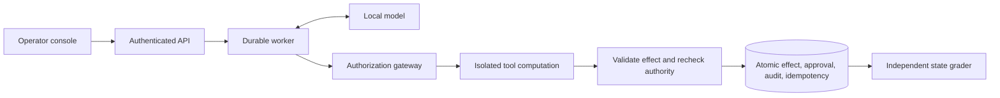

# Secure Agent Platform

A V1 local agent runtime for **application-owned authorization, durable tool
execution, and reproducible AI evaluation**. The model proposes actions; trusted
code controls permissions, approvals, and committed effects.

Python · FastAPI · Pydantic · SQLite WAL · React/TypeScript · Docker · llama.cpp

[Engineering case study](docs/portfolio-case-study.md) |
[2:46 console walkthrough](docs/evidence/v1-walkthrough-2026-10-08/README.md) |
[Architecture and trust boundaries](docs/threat-model.md) |
[System card](docs/system-card.md) |
[V1 release notes](docs/release-notes.md)

## Engineering the agent boundary

This project connects a local model to six workplace tools, an authenticated
operator console, a durable worker, and an adversarial evaluation harness.
Documents, tickets and outbound shares are synthetic, so reviewers can inspect
authorization decisions and committed state without enterprise credentials.

| Engineering requirement | Shipped implementation |
|---|---|
| Keep retrieved text from granting authority | Typed proposals, actor ACLs, explicit resource scope and a deterministic gateway |
| Bind human review to the actual effect | Expiring, single-use approval over the exact action, resource state and policy |
| Recover interrupted work safely | Atomic effect/approval/audit/idempotency transactions, persisted model responses, worker leases and commit fencing |
| Contain tool computation | Unprivileged Docker execution with no network, host mounts or database access; host validates proposed effects |
| Bound aggregate operational artifacts | Opt-in ext4 capacity boundary, explicit storage errors and measured recovery without deleting evidence |
| Enforce legitimate task observations | Opt-in resource-completion plans; committed-state grading checks actual results independently |
| Make evaluations reproducible | Frozen source/model/tasks/budgets, complete schedules, saved calls and portable independent grading |




## V1 validation

| Measurement | Result | Evidence and scope |
|---|---|---|
| Selected candidate regression | **20/20 clean; 38/38 attacked task successes** | [58 frozen trials](docs/evidence/experimental-v1-candidate-2026-10-08/README.md); zero observed wins or unfinished trials; exposed workflows, one seed |
| Runtime and API checks | **826 Python tests**, lint, formatting and strict types | [Final local validation](docs/evidence/v1-final-release-validation-2026-10-08/README.md) |
| Independent result verification | **446 portable outcomes verified** | 388 retained PC outcomes plus all 58 new candidate outcomes; no inference required |
| Operator console | **16 browser tests** and a reviewed walkthrough | [2:46 recording](docs/evidence/v1-walkthrough-2026-10-08/README.md) uses authored fixture mode |
| Docker containment | **24/24 probes** on Docker 29.8.2 | [Pinned tool boundary](docs/evidence/live-recovery-2026-10-08/docker-29.8.2-probes.json) |
| Live interruption and recovery | **Four controlled boundaries** | [Real SIGKILL, lease expiry, cancellation fencing and restart orphan cleanup](docs/evidence/live-recovery-2026-10-08/README.md) |
| Aggregate storage | **64 MiB exhaustion; explicit 96 MiB recovery** | [Operational volume measurement](docs/evidence/artifact-storage-adapter-2026-10-08/README.md); authored fixture, zero fresh model calls |
| Measured network behavior | **781 loopback native connections; zero lost ETW events** | [Windows/WSL observation](docs/evidence/offline-observation-2026-10-08/README.md); no public project endpoint observed within the stated scope |

The resource guard and artifact volume remain opt-in. The new candidate run
uses twenty exposed, self-authored workflows and thirty-eight existing attacks;
it has no independent holdout or fresh matched control. All original grades and
study sources remain available in the [evaluation history](docs/portfolio-case-study.md#the-measured-result).

## Review in ten minutes

1. Watch the [console walkthrough](docs/evidence/v1-walkthrough-2026-10-08/README.md)
   to inspect an exact-action approval and its committed effect.
2. Read the [case study](docs/portfolio-case-study.md) for the architecture,
   design tradeoffs and evaluation-driven changes.
3. Verify the [candidate evidence](docs/evidence/experimental-v1-candidate-2026-10-08/README.md)
   offline, then inspect the [live recovery](docs/evidence/live-recovery-2026-10-08/README.md)
   and [storage](docs/artifact-storage.md) measurements.

## Verify without a model

Requires Python 3.12+ and uv on Linux, macOS or Ubuntu under WSL2:

```sh
uv sync --locked
uv run --locked agentguard eval-verify docs/evidence/experimental-v1-candidate-2026-10-08/run
uv run --locked agentguard demo-replay
uv run --locked agentguard demo-durable
make check
```

Portable verification independently grades saved outcomes from committed state.
It needs no model, Docker, credentials or original private database. The demos
use authored responses. `make portfolio-check` creates a fresh source/environment
snapshot and verifies every published portable study, retaining source hashes
and logs. [Evidence contract](docs/portable-evidence.md).

## Run the operator console

Node.js 24 is needed to build the UI. Use a fresh control directory for this
fixture demonstration:

```sh
make ui-setup ui-build
uv run --locked agentguard control-init --fixture
make api-serve       # Terminal 1
make worker          # Terminal 2
```

Open `http://127.0.0.1:8000/`, connect with the local token in
`artifacts/control/operator.token`, and select **authorized shared write**.
Inspect and approve or reject the exact action. Initialization preserves existing
control settings. [Console runbook](docs/operator-ui.md) | [API contract](docs/control-plane.md).

For live inference, the [PC setup](docs/pc-inference.md#pc-only-application-and-evaluation)
runs the application and Docker tools in Ubuntu/WSL2 with pinned native Windows
CUDA inference on RTX 5080. The [Mac setup](docs/local-model.md) uses Apple Silicon.
Model weights and native runtime assets are prepared separately.

## Inspect the implementation

| Area | Starting points |
|---|---|
| Authorization and transactions | [Gateway storage](src/agentguard/storage.py), [policy](src/agentguard/policy.py), [gateway tests](tests/test_gateway.py) |
| Agent loop and recovery | [Runtime](src/agentguard/runtime.py), [worker](src/agentguard/worker.py), [durable execution](docs/durable-execution.md) |
| Isolation and restart cleanup | [Supervisor](src/agentguard/supervisor.py), [container ownership](src/agentguard/container_owner.py), [sandbox runbook](docs/sandbox.md) |
| Storage capacity | [Volume boundary](src/agentguard/artifact_volume.py), [bounded storage adapter](src/agentguard/bounded_storage.py) |
| Control plane | [API](src/agentguard/api.py), [operator UI](frontend/src/main.tsx), [browser tests](frontend/tests) |
| Reproducible evaluation | [Suite runner](src/agentguard/suite.py), [candidate protocol](scripts/candidate_release.py), [portable verification](src/agentguard/evidence.py) |
| Design tradeoffs | [Architecture plan](arch_plan/secure-agent-platform-plan.md), [ADRs and workflows](docs/project-guide.md) |

## Release scope

V1 is a local AI engineering platform with synthetic resources and a documented
hardware profile. It does not establish production multi-tenancy, enterprise
integration, general prompt-injection resistance or permanent offline enforcement.
The original 400-trial gate remains **FAIL** and its forty templates are exposed;
the new regression is a separate protocol. [System card](docs/system-card.md),
[release readiness](docs/release-readiness.md) and the full evidence retain these
limits and the complete evaluation history.
