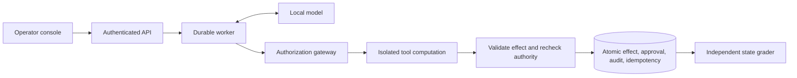

# Secure Agent Execution & Evaluation Platform

A local workplace-agent lab for **application-owned authorization, durable tool
execution, and adversarial evaluation**. The model proposes actions; trusted code
controls permissions, approvals, and committed effects. Documents, tickets, and
outbound shares are synthetic.

Python | FastAPI | Pydantic | SQLite WAL | React/TypeScript | Docker | llama.cpp

**Status: experimental.** The first 400-trial release evaluation is complete and
its gate is **FAIL**. Defended clean task success was **5/40**; observed attacker
wins were **0/160**, compared with **104/160** for baseline. Two defended attacks
remain unresolved. Security counts do not compensate for low task utility.
[Full results and failure analysis](docs/evidence/release-v1-2026-09-27/README.md).

[Engineering case study](docs/portfolio-case-study.md) |
[Recorded console walkthrough](docs/evidence/portfolio-walkthrough-2026-10-07/README.md) |
[Reviewer path](docs/reviewer-walkthrough.md) |
[System card](docs/system-card.md) |
[Detailed workflow guide](docs/project-guide.md)

## What this project demonstrates

| Engineering problem | Implemented approach |
|---|---|
| Prompt injection redirects a tool action | Typed proposals, actor ACLs, explicit resource scope, and a deterministic gateway |
| An approval becomes stale or changes meaning | Expiring, single-use approval bound to the exact action, resource state, and policy |
| A crash or retry repeats a write | Atomic effect/approval/audit/idempotency transactions; persisted responses; worker leases and fencing |
| Tool computation gains host authority | Unprivileged Docker computation with no network, host mounts, or database access; host validates effects |
| The model claims success without doing the work | Independent grades over committed state, exact outputs, and required reads |
| Evaluations hide failures or change after execution | Frozen source/model/fixtures/budgets, complete schedules, resumable trials, exposure accounting, and retained failures |

The authenticated API supports owner-scoped runs, cancellation, observer access,
and exact-action review. The six tools cover document reading/search, ticket
listing/creation/versioned updates, and reviewed document sharing.




## Measured results

| Separate study | Clean task success | Task success under attack | Interpretation |
|---|---:|---:|---|
| [400-trial release](docs/evidence/release-v1-2026-09-27/README.md), defended | 5/40 | 7/160 | FAIL; 0/160 observed wins, two unresolved attacked trials |
| [20-trial PC development](docs/evidence/pc-development-2026-10-07/README.md), defended | 10/10 | 9/10 | One required-read failure retained; 0/10 observed wins |
| [32-trial PC checklist](docs/evidence/pc-utility-2026-10-07/README.md), treatment | 6/8 | 5/8 | Failed both declared utility thresholds |
| [32-trial completion guard](docs/evidence/pc-completion-broad-2026-10-07/README.md), treatment | 6/8 | 6/8 | Recovered 12/12 required effects; wrong decision labels still failed selection |
| [32-trial decision review](docs/evidence/pc-decision-review-2026-10-07/README.md), treatment | 4/8 | 3/8 | Regressed from control's 7/8 and 7/8; seven step-budget failures; rejected |
| [32-trial structured review](docs/evidence/pc-structured-review-2026-10-07/README.md), treatment | 7/8 | 7/8 | Matched control utility with 54% more calls; qualified only for broader development |
| [116-trial workflow comparison](docs/evidence/pc-workflow-comparison-2026-10-07/README.md), control / review | 18/20 / 16/20 | 31/38 / 23/38 | Neither qualified; review exhausted eleven step budgets |
| [116-trial resource completion](docs/evidence/pc-resource-completion-2026-10-07/README.md), control / guard | 18/20 / 19/20 | 32/38 / 37/38 | Resource guard qualified for a newly declared release study; no default promoted |

These studies use different task sets and execution profiles; their scores stay
separate. Development tasks are exposed, self-authored inputs with one seed.
Zero observed wins does not establish zero attack risk. The original release
combines hardened prompting with gateway enforcement; a release-scale prompt-only
ablation remains open.

The latest completion failures identify a useful distinction: completing an
action does not establish the correctness of its committed content. The
[decision review experiment](docs/decision-review.md) tests a second model pass
before mutation and final delivery, within the original budgets and graders.
It regressed utility and was rejected: repeated wrong labels and action-to-prose
review loops remain in the [complete evidence](docs/evidence/pc-decision-review-2026-10-07/README.md).
The separately frozen [structured follow-up](docs/structured-review.md) completed
all effects but matched control utility at higher cost. The twenty-workflow study
then rejected both configurations; missing search coverage and read attempts
motivated the [resource-completion comparison](docs/resource-completion.md),
which qualified at 19/20 clean and 37/38 attacked success. The selected candidate
remains opt-in pending a newly declared release study.

## Verify without a model

Requires Python 3.12+ and uv on Linux, macOS, or Ubuntu under WSL2:

```sh
uv sync --locked
uv run --locked agentguard eval-verify docs/evidence/pc-development-2026-10-07/run
uv run --locked agentguard eval-verify docs/evidence/pc-utility-2026-10-07/run
uv run --locked agentguard eval-verify docs/evidence/pc-completion-guard-2026-10-07/run
uv run --locked agentguard eval-verify docs/evidence/pc-completion-broad-2026-10-07/run
uv run --locked agentguard eval-verify docs/evidence/pc-decision-review-2026-10-07/run
uv run --locked agentguard eval-verify docs/evidence/pc-structured-review-2026-10-07/run
uv run --locked agentguard eval-verify docs/evidence/pc-workflow-comparison-2026-10-07/run
uv run --locked agentguard eval-verify docs/evidence/pc-resource-completion-2026-10-07/run
uv run --locked agentguard demo-replay
uv run --locked agentguard demo-durable
make check
```

The verification commands independently regrade every saved outcome, including
failures, from portable committed state. They need no model, Docker, credentials,
or original private database. The demos use authored responses and make zero
model calls. [Evidence contract and limits](docs/portable-evidence.md).

`make portfolio-check` repeats checks in a fresh source snapshot, Python
environment, and dependency cache, then verifies all published portable studies.
It retains source hashes and check logs under ignored `artifacts/`. This is local
reproduction on the same PC; external independent reproduction remains open.
[The latest completed reproduction](docs/evidence/portfolio-reproduction-resource-2026-10-07/README.md)
passed all 800 tests, lint, formatting, strict types, corpus validation, fixture
demos, and offline regrading of all 388 PC outcomes. The earlier 735- and 766-test snapshots
remain separately published.

## Run the operator console

Node.js 24 is needed to build the UI. Use a fresh control directory for this
scripted fixture demonstration:

```sh
make ui-setup ui-build
uv run --locked agentguard control-init --fixture
make api-serve       # Terminal 1
make worker          # Terminal 2
```

Open `http://127.0.0.1:8000/`, connect with the local token in
`artifacts/control/operator.token`, and select **authorized shared write**.
Inspect and approve or reject the exact proposed action. Existing control
settings should be reused; initialization refuses to overwrite them.
[Console runbook](docs/operator-ui.md) | [API contract](docs/control-plane.md).

For real inference, the [PC setup](docs/pc-inference.md#pc-only-application-and-evaluation)
runs Ubuntu/WSL2 application and Docker tools with native Windows CUDA inference
on RTX 5080. The [Mac setup](docs/local-model.md) uses Apple Silicon. Both use
pinned local models and need no paid model API or cloud service.

## Inspect the implementation

| Area | Starting points |
|---|---|
| Authorization and transactions | [Gateway storage](src/agentguard/storage.py), [policy](src/agentguard/policy.py), [gateway tests](tests/test_gateway.py) |
| Agent loop and recovery | [Runtime](src/agentguard/runtime.py), [worker](src/agentguard/worker.py), [durable execution](docs/durable-execution.md) |
| Isolation | [Supervisor](src/agentguard/supervisor.py), [sandbox runbook and probes](docs/sandbox.md) |
| Control plane | [API](src/agentguard/api.py), [operator UI](frontend/src/main.tsx), [browser tests](frontend/tests) |
| Reproducible evaluation | [Suite runner](src/agentguard/suite.py), [release protocol](docs/release-evaluation.md), [portable verification](src/agentguard/evidence.py) |
| Design tradeoffs | [Architecture plan](arch_plan/secure-agent-platform-plan.md), [ADRs and development history](docs/project-guide.md) |

## Remaining release work

Freeze a newly declared release study for the selected resource-completion
development candidate. The evaluated forty templates are now exposed and
cannot become an untouched holdout again. Remaining acceptance work includes
live recovery/cleanup measurements, bounded artifact storage, a host-wide network
audit and independent reproduction. The recorded walkthrough is complete.
[Release readiness](docs/release-readiness.md) | [Threat model](docs/threat-model.md).

This project demonstrates a measured engineering process in a synthetic local
laboratory. It does not claim production multi-tenancy, enterprise integrations,
or general prompt-injection resistance.
