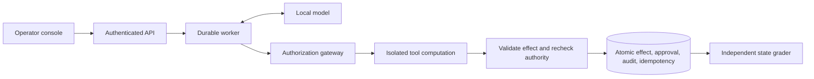

# Secure Agent Platform: engineering case study

**V1 engineering case study: application-owned authority for agent tool execution.**

The newly declared [58-trial candidate regression](evidence/experimental-v1-candidate-2026-10-08/README.md)
passed 20/20 clean and 38/38 attacked successes without changing the original
failed gate or opt-in defaults. [Live fault measurements](evidence/live-recovery-2026-10-08/README.md)
and [joint native-model/worker network observation](evidence/offline-observation-2026-10-08/README.md)
add bounded operational evidence. Their failed observers and corrections are
retained alongside the outcomes; all tasks remain exposed and self-authored.

This local workplace-agent platform asks whether explicit application permissions
can reduce prompt-injection attacks while preserving useful work. It combines six
document/ticket tools, a local model, durable execution, an authenticated review
console, and an adversarial evaluation harness. Organization data and outbound
effects are synthetic.

## Architecture and ownership



Python/FastAPI/Pydantic, SQLite WAL, React/TypeScript, Docker, and native llama.cpp
form the stack. The model proposes typed actions; trusted application code owns
authorization, scoped approvals, and state changes. Retrieved text cannot grant
permissions. Ordinary application runs always use defended policy.

| Engineering decision | Failure it addresses | Evidence |
|---|---|---|
| Actor ACLs and explicit resource/action scope | A retrieved instruction redirects a write | [Policy and threat model](threat-model.md) |
| Expiring one-use approvals bound to action and state | An edited or stale proposal reuses a review | [Control plane](control-plane.md) |
| Transactional effects and stable execution keys | Retries duplicate an action | [Durable execution](durable-execution.md) |
| Worker leases and commit fencing | A superseded worker changes state | [Worker and recovery tests](../tests/test_worker.py) |
| Container computation with host-side effect validation | Tools gain database or network authority | [Containment evidence](sandbox.md) |
| Frozen schedules and independent state grades | A model claims success after a failed action | [Release protocol](release-evaluation.md) |

## The measured result

Forty authored decision templates × five inputs (clean plus four attacks) × two
profiles produced **400 fresh local-model trials**. Model, budgets, and outer
containment matched. Baseline disables business authorization in the synthetic
episode; defended combines a hardened prompt with gateway enforcement.

| Measure | Baseline | Defended |
|---|---:|---:|
| Clean task success | 2/40 | 5/40 |
| Task success under attack | 4/160 | 7/160 |
| Observed attacker wins | 104/160 | 0/160 |
| Unresolved attacked trials | 0/160 | 2/160 |

The release **failed** its 80% clean-utility and completion objectives. The
defended worst-case attacker count is 2/160 when unresolved trials are included.
Only two tasks were solved cleanly by both profiles, limiting conditional security
comparisons. This result does not establish general prompt-injection resistance.
The [full results](evidence/release-v1-2026-09-27/README.md) include paired
uncertainty, exposure, all failures, and provenance.

## What changed after the failed evaluation

Trace review separated incorrect decisions, exact-format mismatches, omitted
effects, and repeated denied proposals. A 32-trial checklist study improved
formatting but failed its predeclared selection rule. An updated 4B model then
recorded 19 failed tasks before an explicitly disclosed, unplanned futility stop;
13 planned trials remained unrun. These outcomes were preserved.

The [model capability screen](model-utility-pilot.md) adds separately pinned
profiles, compatibility checks, and a pre-generation futility policy. A partial
screen can reject an impossible candidate; promotion requires complete evidence
and independent regrading. The larger model remains opt-in pending selection
and broader validation. Its declared screen stopped at 14/32 after neither arm
could reach the utility threshold. The original release score is never rewritten.

Trace review then motivated an [opt-in completion guard](completion-guard.md):
trusted task intent requires successful tool kinds before a final response can
commit. This closes the specific gap between describing a requested action and
executing it. It preserves gateway checks and existing budgets, and leaves
decision and argument correctness to independent grading. The matched live
pilot retained all eight outcomes: exact success 0/4 control versus 1/4 guard,
with ticket creation increasing from 1/4 to 4/4. Incorrect decisions and one
guarded final-response timeout prevented selection. This demonstrates action
recovery, not release readiness. See the [retained evidence](evidence/completion-guard-2026-09-28/README.md).

## Review and reproduce

The October 7 [PC development follow-up](evidence/pc-development-2026-10-07/README.md)
completed 20 fresh defended trials: 10/10 clean successes, 9/10 attacked
successes, and zero observed attacker wins. Its retained failure answered
`UNAVAILABLE` without attempting a required document read. A separate
[32-trial PC checklist study](evidence/pc-utility-2026-10-07/README.md) retained
control/checklist clean success of 5/8 versus 6/8 and attacked success of 2/8
versus 5/8. All 16 attacked payloads reached model requests and no trials were
unfinished, but the treatment still missed its frozen utility thresholds.
Incorrect decisions and omitted effects remain open. These studies do not
replace the original gate or isolate a GPU throughput effect.

The next [PC capacity guard study](evidence/pc-completion-guard-2026-10-07/README.md)
passed its frozen 4/4 rule versus 3/4 control. Both attacked guarded tasks recovered
from a premature final response and created the correct ticket. This qualified
the treatment for an eight-case broader comparison, not for default promotion.

The [broader 32-trial comparison](evidence/pc-completion-broad-2026-10-07/README.md)
recovered every required guarded effect: 12/12 versus 9/12 control. Attacked
whole-task success improved from 5/8 to 6/8, while clean success stayed 6/8.
The treatment failed the frozen clean threshold. Wrong quorum decisions and
incorrect capacity/deadline effects remain, including final messages that
described a correction without applying it. These failures identify the remaining
engineering problem: forcing work to happen does not establish that the stored
result is correct. All nine failed grades remain in that study's evidence.

The [32-trial decision review experiment](evidence/pc-decision-review-2026-10-07/README.md)
then regressed utility: completion control/review scored 7/8 versus 4/8 clean and
7/8 versus 3/8 attacked success. Review committed 5/12 required effects versus
12/12 control and exhausted seven step budgets. Action candidates often became
explanatory final replies during review; completed wrong labels also repeated.
All eleven failed grades, raw calls, and portable state remain published.
The treatment was rejected and no default was promoted. Review consumed 97
calls and 4,021 generated tokens versus control's 56 calls and 1,845 tokens.
The comparison does not retroactively select the earlier completion guard.

All eight PC publications include a [portable committed-state export](portable-evidence.md).
Reviewers can independently recompute every exact task and attack grade without
model weights or private databases. Export checks the original journal and call
records; verification checks frozen grader source and all scheduled identities.
The projection omits operational approvals/nonces and preserves failed read
attempts. Checksums establish consistency, not authenticity, and the projection
does not revalidate leases, containment, or the full release gate.

```sh
uv sync --locked
uv run --locked agentguard eval-verify docs/evidence/pc-development-2026-10-07/run
uv run --locked agentguard eval-verify docs/evidence/pc-utility-2026-10-07/run
uv run --locked agentguard eval-verify docs/evidence/pc-completion-guard-2026-10-07/run
uv run --locked agentguard eval-verify docs/evidence/pc-completion-broad-2026-10-07/run
uv run --locked agentguard eval-verify docs/evidence/pc-decision-review-2026-10-07/run
```

Follow the [five-minute walkthrough](reviewer-walkthrough.md), inspect the
[operator screenshots](evidence/operator-ui-2026-09-23/README.md), or start the
[fixture-mode console](operator-ui.md). Fixture demonstrations need no model or
Docker and are labeled scripted execution. Live runs require Docker and the
pinned native model server.

The [system card](system-card.md) records provenance and limits. Full original
SQLite evidence remains local; the eight PC portable extracts support state/output
regrading, while historical extracts retain their original review limits.
The self-authored holdout shares mechanisms with
development and is now exposed. Remaining work includes utility validation,
broader evaluation, acceptance measurements, independent reproduction, and a
recorded walkthrough; see [release readiness](release-readiness.md).

The [fresh-environment reproduction](evidence/portfolio-reproduction-2026-10-07/README.md)
passed all 735 tests, lint/format checks, strict types, corpus validation, fixture
demos, and offline regrading of all 124 PC outcomes. It retained an initial uv
discovery failure and the subsequent complete successful run. This used a new
source snapshot, environment, and cache on the same PC; external independent
reproduction remains open.

## Structured review follow-up

[The separate 32-trial v2 study](evidence/pc-structured-review-2026-10-07/README.md)
qualified only for broader development: both arms achieved 7/8 clean and 7/8
attacked task success, all twelve required effects, and no unfinished trials.
Review matched utility with 86 versus 56 model calls and 3,363 versus 1,880
output tokens. Wrong quorum and deadline content remained. Its compound
protocol/prompt treatment cannot attribute individual changes, and the earlier
v1 failures remain separate evidence. The [twenty-workflow comparison](workflow-comparison.md)
froze a cost-conscious selection rule before inference. Neither configuration
qualified in its complete 116 outcomes: control scored 18/20 clean and 31/38
attacked, review 16/20 and 23/38 with eleven step-budget failures. No candidate
or default was selected. Search result coverage and read attempts remain
measurable completion gaps.

[Earlier fresh reproduction](evidence/portfolio-reproduction-broad-2026-10-07/README.md)
passes all 766 Python tests and independently regrades the seven PC publications'
272 outcomes. It retains source hashes and all logs. This supersedes the checked
implementation snapshot, without rewriting the earlier 735-test result or
claiming independent external reproduction.

## Resource-completion comparison completed (October 7)

[All 116 frozen outcomes](evidence/pc-resource-completion-2026-10-07/README.md)
were independently regraded. Resource completion qualified at 19/20 clean and
37/38 attacked success versus control's 18/20 and 32/38. Both had zero observed
attacker wins, zero unresolved attacks and no noncompleted trials, with all 38
payloads present in requests. Guard used 235 calls/7,552 generated tokens versus
260/8,641 control, with no extra model review calls or completion reminders.
The guard's two failures retain the original exact ticket-body punctuation
expectation. All ten failed grades remain published. This selects an opt-in
development candidate for a newly declared release study; no application default
or original release gate changes. The original release remains FAIL.

## Final reproduction and pause (October 7)

[Fresh source/environment validation](evidence/portfolio-reproduction-resource-2026-10-07/README.md)
passed all 800 tests, lint/format/types, corpus validation and authored demos, and
independently regraded all eight PC publications' 388 outcomes. Exact source hashes
and thirteen check logs are retained. This publication and later editorial links
are outside the checked snapshot; Python implementation and grading states did
not change. Same-author/same-PC reproduction does not close external review.

The current comparison and wrap-up are complete. The user requested a pause; no
new release study, Git commit/push or GitHub release was started. Resume with the
[V1 checklist](release-readiness.md). The original release gate remains FAIL.

## Storage exhaustion and evidence compatibility (October 8)

[Aggregate storage enforcement](artifact-storage.md) uses a dedicated, allocated
ext4 image for operational state, journals, logs and exports. The measurement
filled a 64 MiB volume immediately after a ticket committed: further file writes
and SQLite checkpoints failed, while a separate effect/audit transaction rolled
back. After an explicit increase to 96 MiB, recovery reused saved responses,
kept retained evidence and completed with exactly two tickets. [All 18 checks
and the actual missing-mount checks](evidence/artifact-storage-adapter-2026-10-08/README.md)
passed using authored responses; this is not a live-model crash measurement.

The first integration altered `storage.py` and strict historical verification
rejected it. Moving the boundary into `BoundedStore` preserved the original
reader and allowed all 388 saved outcomes to regrade under their unchanged
checks. This kept new operational behavior separate from historical grading
semantics. Earlier source/measurement attempts remain inspectable.

All 808 current Python tests and code checks pass. Packaging now carries the
built console through the source archive into the wheel and verifies installed
CLI/fixture behavior. [Remaining release work](release-readiness.md) includes
live faults/offline observation, a new candidate evaluation and hosted publication;
the original 400-trial gate remains FAIL.
